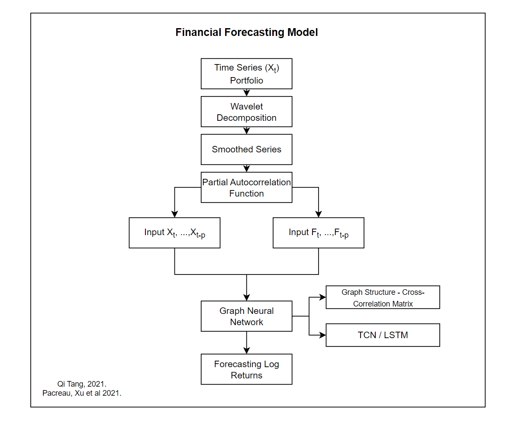
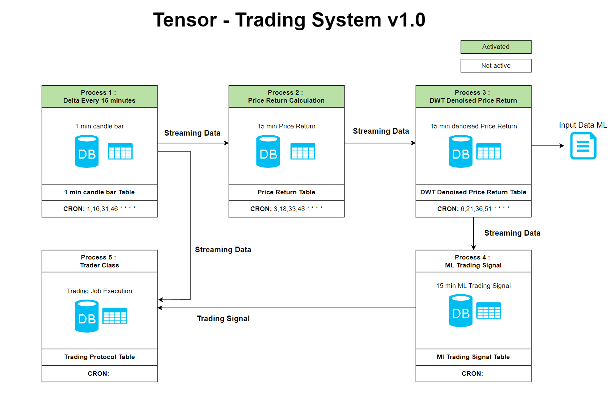

============
TensorTrader
============

.. image:: https://img.shields.io/pypi/v/tensortrader.svg
        :target: https://pypi.python.org/pypi/tensortrader

.. image:: https://img.shields.io/travis/john2408/tensortrader.svg
        :target: https://travis-ci.com/john2408/tensortrader

.. image:: https://readthedocs.org/projects/tensortrader/badge/?version=latest
        :target: https://tensortrader.readthedocs.io/en/latest/?version=latest
        :alt: Documentation Status

Tensor Algorithmic Trader

Python package to train ML based models for automated trading strategy on cryptocurrencies. 
Using Python Binance API. 

To start run file tensortrader/task/bactesting_task.py. Change configuration on backtesting.yml and feature_eng.yml.

* Free software: MIT license
* Documentation: https://tensortrader.readthedocs.io.

Tensor ML Return Signal Training - Strategy
--------

Tensor Trading System
--------

To Do's
--------

* Create Trading Execution class
* Create Trading Performance Tracking

Credits
-------

This package was created with Cookiecutter_ and the `audreyr/cookiecutter-pypackage`_ project template.

.. _Cookiecutter: https://github.com/audreyr/cookiecutter
.. _`audreyr/cookiecutter-pypackage`: https://github.com/audreyr/cookiecutter-pypackage
