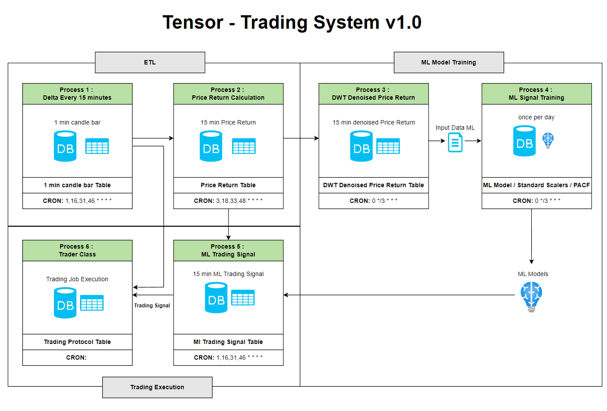

============
TensorTrader
============

.. image:: https://img.shields.io/pypi/v/tensortrader.svg
        :target: https://pypi.python.org/pypi/tensortrader

.. image:: https://img.shields.io/travis/john2408/tensortrader.svg
        :target: https://travis-ci.com/john2408/tensortrader

.. image:: https://readthedocs.org/projects/tensortrader/badge/?version=latest
        :target: https://tensortrader.readthedocs.io/en/latest/?version=latest
        :alt: Documentation Status

Tensor Algorithmic Trader

Python package to train ML based models for automated trading strategy on cryptocurrencies. 
Using Python Binance API. 

To start run file tensortrader/task/bactesting_task.py. Change configuration on backtesting.yml and feature_eng.yml.

* Free software: MIT license
* Documentation: https://tensortrader.readthedocs.io.

Tensor ML Return Signal Training - Strategy
--------

Tensor Trading System
--------

Features
--------

* Adjust all yml config files (done)
* Create logging (done)
* Export Charts to PDF File (done)
* Model Storage (done)
* Run multiple combinations of models (done) 
* Adjust resampling for chandle stick --> 10 min, 5 min. (done)
* Create Strategy based on Returns --> then also create labels from it (done)
* Create XGBoost Regressor for Return Forecasting--> New Strategy (done)
* Test models with resampling (5min, 10 min) (done)
* Create functionality for Backtesting for (done): 
*   (1) label_mode: return & target_type: regression
*   (2) label_mode: return & target_type: classification
*   (3) label_mode: TBM & target_type: classification
* Adjust Information stored in logs (done)
    
* Create Automated Backend - Tensor Trading System - 15min Trader (in progress)

* Create new full test for all coins with all functionallities
        
* Technical Strategies Pool
* Adjust Metalables Strategies 
* --> LSTM --> GNN = CTN + GN 

Credits
-------

This package was created with Cookiecutter_ and the `audreyr/cookiecutter-pypackage`_ project template.

.. _Cookiecutter: https://github.com/audreyr/cookiecutter
.. _`audreyr/cookiecutter-pypackage`: https://github.com/audreyr/cookiecutter-pypackage
